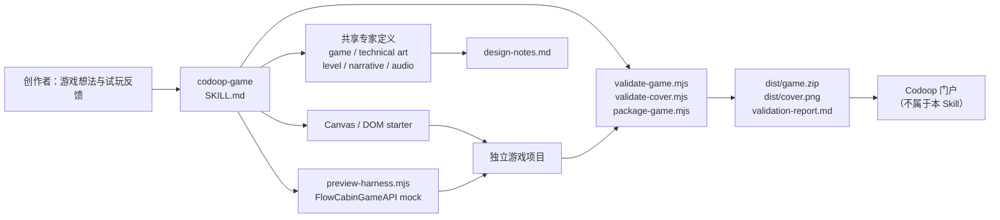

# codoop-game Skill 架构

`codoop-game` 是一个“agent 做创意和工程判断，脚本负责可重复校验”的离线 H5 游戏创建系统。它不直接发布游戏，也不在首版声明已通过真实 Codoop Desktop webview 验证；它的责任是让创作者获得可试玩、可本地验证、可带到门户提交的产物。

## 组件边界

| 层 | 位置 | 职责 |
| --- | --- | --- |
| 插件发现 | `.codex-plugin/`、`.claude-plugin/`、`.agents/plugins/` | 让 Codex 和 Claude 指向同一份 Skill 内容。 |
| 主编排 | `skills/codoop-game/SKILL.md` | 规定何时询问、加载专家、预览、复审与交付。 |
| 专家视角 | `skills/_shared/` | 输出游戏体验、视觉、关卡、叙事或音频的放行结论。 |
| 稳定契约 | `skills/codoop-game/references/`、`docs/compatibility.md` | 固化 Flow Cabin API、离线限制、封面和包规则。 |
| 确定性执行 | `skills/codoop-game/scripts/` | 创建项目、提供 mock、静态校验与打包。 |
| 游戏项目 | 创作者指定的工作目录 | 存放实际游戏源码、资源、设计记录与交付物；不写回 Skill 仓库。 |

## 创建与迭代流程

1. **游戏小卡**：主 Skill 用自然语言收敛玩家目标、循环、控制、反馈、结束/续玩方式和本轮假设，写入 `design-notes.md`。
2. **专家编排**：游戏设计师和技术美术固定参与。地图或难度推进触发关卡设计师；剧情与选择触发叙事设计师；任何声音需求触发音频设计师。
3. **首次可玩版本**：`create-game.mjs` 将 Canvas 或 DOM starter 复制到独立项目。游戏只使用本地静态资源和 `window.FlowCabinGameAPI`。
4. **预览验证**：`preview-harness.mjs` 启动本地服务器，在页面注入生产 API 的最小 mock，并提供输入、resize、pause、resume、destroy 的操作表面。
5. **反馈回路**：每次只改一项玩家可感知的体验。游戏设计师先判断影响范围，再加载受影响专家，修改后再次预览。
6. **交付门禁**：全部已触发专家最终放行后，运行游戏与封面校验；`package-game.mjs` 只归档运行文件到 `game.zip`，同时把经过验证的封面复制为独立 `dist/cover.png`。

## 质量门

| 门 | 责任主体 | 阻止条件 |
| --- | --- | --- |
| 体验门 | 已触发专家 | 玩家目标、操作、可读性、节奏或可选音频没有明确放行。 |
| 生命周期门 | starter + harness | 暂停、恢复、销毁、resize 或保存策略不成立。 |
| 离线门 | `validate-game.mjs` | 缺少根目录 `index.html`，存在网络依赖、危险动态执行、服务 worker、Node/Electron 引用，或超出文件/体积限制。 |
| 封面门 | `validate-cover.mjs` | 不是 PNG、不是 16:9 或小于 640×360。 |
| 交付门 | `package-game.mjs` | 游戏或封面校验失败；ZIP 超过 20 MB；封面被放入运行 ZIP。 |

## 关键设计选择

- **单一公开 Skill**：创作者只面对 `codoop-game`，不用选择或管理专家角色。
- **渐进加载**：`SKILL.md` 保持流程简洁；稳定细节进入 references；条件专家只在命中时读取。
- **本地优先**：所有资源必须在 ZIP 内，封面与运行包分离，门户发布保持在 Skill 边界外。
- **可恢复体验**：starter 把保存、暂停、恢复、销毁和尺寸变化作为基础能力，而非游戏完成后的附加项。
- **诚实验证边界**：harness 证明的是本地 API 契约模拟；真实 Electron/webview E2E 接入后才能升级 Desktop 兼容性结论。
