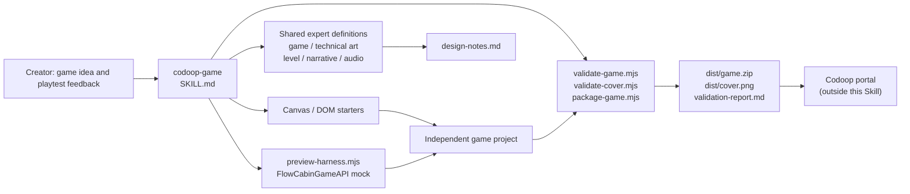

# codoop-game Skill Architecture

**English** · [简体中文](./skill-architecture.zh-CN.md)

`codoop-game` is an offline, desktop-only H5 game-creation system where the agent makes creative and engineering decisions while scripts perform repeatable checks. It does not publish games, and v1 does not claim real Codoop Desktop webview validation. Its responsibility is to deliver a polished, playable, locally validated package that a creator can take to the portal.

## Component boundaries

| Layer | Location | Responsibility |
| --- | --- | --- |
| Plugin discovery | `.codex-plugin/`, `.claude-plugin/`, `.agents/plugins/` | Makes Codex and Claude discover the same Skill. |
| Main orchestration | `skills/codoop-game/SKILL.md` | Defines questions, expert loading, preview, review, and delivery. |
| Expert perspectives | `skills/_shared/` | Produces release decisions for game feel, visual design, levels, narrative, or audio. |
| Stable contracts | `skills/codoop-game/references/`, `docs/compatibility.md` | Freezes the Flow Cabin API, offline restrictions, cover rules, and package rules. |
| Deterministic execution | `skills/codoop-game/scripts/` | Creates projects, serves the mock, validates static content, and packages outputs. |
| Game project | Creator-selected workspace | Holds game source, assets, design notes, and deliverables; it never writes back into the Skill repository. |

## Creation and iteration

1. **Game card** — the main Skill captures player goal, loop, controls, feedback, ending/continuation model, and the current change hypothesis in `design-notes.md`.
   It also completes `visual-direction.md`, which keeps art direction stable across iterations.
2. **Expert orchestration** — game design and technical art always participate. Maps or progression trigger level design; characters, story, or choices trigger narrative design; any sound triggers audio design.
3. **First playable build** — `create-game.mjs` copies a Canvas or DOM starter into an independent project. The game uses only local resources and `window.FlowCabinGameAPI`.
4. **Preview validation** — `preview-harness.mjs` serves the project, injects the minimal production API mock, and exposes desktop input, resize, pause, resume, and destroy controls. The Skill proactively gives the creator a URL and concrete playtest tasks, then records the result in `playtest-report.md`.
5. **Feedback loop** — each iteration changes one player-visible experience. Game design scopes the request, then only affected experts are reloaded before implementation and another focused creator playtest.
6. **Delivery gate** — after final approval from every triggered expert, game and cover validation run. `package-game.mjs` archives only runtime files in `game.zip` and copies the validated cover separately to `dist/cover.png`.

## Quality gates

| Gate | Owner | Blocks delivery when |
| --- | --- | --- |
| Experience | Triggered experts | The player goal, controls, readability, pacing, or optional audio lack explicit approval. |
| Lifecycle | Starter + harness | Pause, resume, destroy, resize, or persistence behavior is not sound. |
| Offline | `validate-game.mjs` | Root `index.html` is missing; network dependencies, dynamic execution, service workers, Node/Electron references, or file/size-limit violations exist. |
| Cover | `validate-cover.mjs` | The cover is not a PNG, is not 16:9, or is smaller than 640×360. |
| Delivery | `package-game.mjs` | Game or cover validation fails, ZIP is larger than 20 MB, or cover enters the runtime ZIP. |

## Key choices

- **One public Skill** — creators interact only with `codoop-game`, never a menu of expert roles.
- **Progressive loading** — `SKILL.md` stays compact; stable detail lives in references; conditional experts load only when relevant.
- **Local-first** — all runtime resources are in the ZIP, product cover and runtime package are separate, and portal publishing stays outside the Skill boundary.
- **Resumable by default** — starters treat persistence, pause, resume, destroy, and resizing as foundations rather than late additions.
- **Desktop by design** — mouse and keyboard are primary; phone and touch-first UI are explicitly out of scope.
- **Honest validation scope** — the harness proves a local API-contract simulation. Only a future Electron/webview E2E can establish a Desktop compatibility claim.
