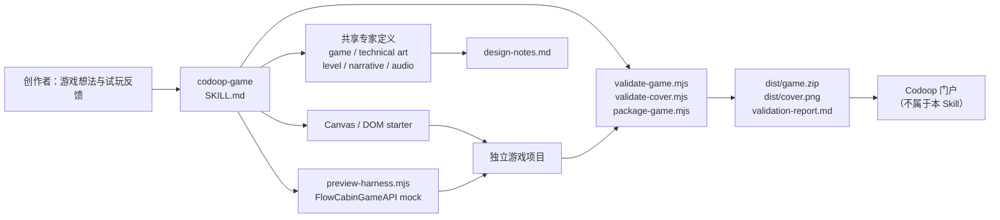

# codoop-game Skill 架构

[English](./skill-architecture.md) · **简体中文**

`codoop-game` 是一个离线 H5 游戏创建系统：agent 负责创意和工程判断，脚本负责可重复的验证。它不负责发布游戏，v1 也不声明已通过真实 Codoop Desktop webview 验证；它只交付创作者可试玩、可本地验证、可带到门户提交的产物。

## 组件边界

| 层 | 位置 | 职责 |
| --- | --- | --- |
| 插件发现 | `.codex-plugin/`、`.claude-plugin/`、`.agents/plugins/` | 让 Codex 和 Claude 发现同一份 Skill。 |
| 主编排 | `skills/codoop-game/SKILL.md` | 规定提问、专家加载、预览、复审和交付。 |
| 专家视角 | `skills/_shared/` | 给游戏体验、视觉、关卡、叙事或音频提供放行结论。 |
| 稳定契约 | `skills/codoop-game/references/`、`docs/compatibility.md` | 固化 Flow Cabin API、离线限制、封面和提交包规则。 |
| 确定性执行 | `skills/codoop-game/scripts/` | 创建项目、提供 mock、静态校验与打包。 |
| 游戏项目 | 创作者指定的工作目录 | 存放源码、资源、设计记录和交付物，不回写到 Skill 仓库。 |

## 创建与迭代

1. **游戏小卡**：主 Skill 将玩家目标、循环、操作、反馈、结束/续玩方式和当前改动假设写入 `design-notes.md`。
2. **专家编排**：游戏设计师和技术美术固定参与。地图或进度触发关卡设计师；角色、剧情或选择触发叙事设计师；任何声音需求触发音频设计师。
3. **首次可玩版本**：`create-game.mjs` 将 Canvas 或 DOM starter 复制到独立项目。游戏只使用本地资源和 `window.FlowCabinGameAPI`。
4. **预览验证**：`preview-harness.mjs` 提供项目、注入最小生产 API mock，并暴露输入、resize、pause、resume 和 destroy 控制。
5. **反馈回路**：每轮只改一项玩家可感知的体验。游戏设计师先界定影响范围，再加载受影响专家、实现并重新预览。
6. **交付门禁**：所有已触发专家最终放行后，运行游戏和封面校验。`package-game.mjs` 只把运行文件归档到 `game.zip`，并将验证通过的封面独立复制到 `dist/cover.png`。

## 质量门

| 门 | 责任主体 | 阻止交付的条件 |
| --- | --- | --- |
| 体验门 | 已触发专家 | 玩家目标、操作、可读性、节奏或可选音频没有明确放行。 |
| 生命周期门 | starter + harness | 暂停、恢复、销毁、resize 或保存策略不可靠。 |
| 离线门 | `validate-game.mjs` | 缺少根目录 `index.html`，存在网络依赖、动态执行、service worker、Node/Electron 引用，或超出文件/体积限制。 |
| 封面门 | `validate-cover.mjs` | 不是 PNG、不是 16:9 或小于 640×360。 |
| 交付门 | `package-game.mjs` | 游戏或封面校验失败，ZIP 超过 20 MB，或封面进入运行 ZIP。 |

## 核心设计选择

- **单一公开 Skill**：创作者只面对 `codoop-game`，不用选择专家角色。
- **渐进加载**：`SKILL.md` 保持简洁；稳定细节放在 references；条件专家只在相关时加载。
- **本地优先**：所有运行资源都在 ZIP 内，商品封面与运行包分离，门户发布处于 Skill 边界外。
- **默认可恢复**：starter 将保存、暂停、恢复、销毁和尺寸变化当作基础能力，而非后期补充。
- **诚实的验证范围**：harness 证明的是本地 API 契约模拟；只有未来接入 Electron/webview E2E 才能声称 Desktop 兼容。
