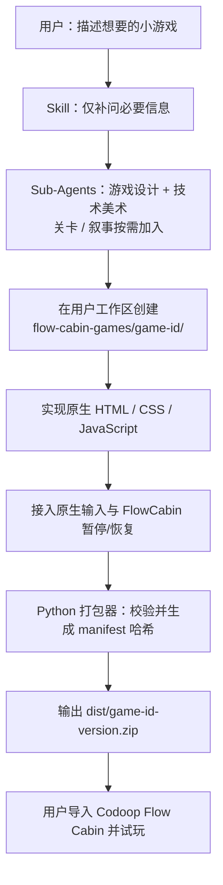

# Flow Cabin 游戏创建 Skill 计划

## 目标

新建独立 Codex 插件项目 `codoop-flowcabin`。用户描述一个小游戏后，Skill 创建可编辑的纯 HTML/CSS/JavaScript 游戏源码，校验并打包为可直接导入 Flow Cabin 的 ZIP。

v1 仅支持游戏；以后可在不改变包安全契约的前提下扩展为其他工具。

## 已确认边界

- 插件提供 `.codex-plugin/plugin.json`、`.claude-plugin/plugin.json` 和 `skills/`，使 Codex 与 Claude 都能发现游戏创建 Skill。
- 游戏使用原生 HTML、CSS、JavaScript；不使用 React、Phaser、Vite 或网络依赖。
- ZIP 必须适配当前 Flow Cabin：根目录包含 `manifest.json` 和 `index.html`，全文件 SHA-256 写入清单。
- 游戏通过浏览器原生键盘、鼠标事件交互；生命周期仅使用 `window.FlowCabinGame.onPause/onResume`，在普通浏览器中应安全降级。
- 打包器采用 Python 标准库实现，不依赖 npm 或系统 `zip` 命令。
- 插件安装目录只读；每个游戏默认创建在用户当前工作区的 `flow-cabin-games/<game-id>/`，发布物输出到该项目的 `dist/<game-id>-<version>.zip`。
- 自动完成包结构与安全校验；最后由用户在 Codoop 中导入并试玩确认。

## 输入契约

Flow Cabin 不提供单独的输入桥接，也没有游戏按键白名单。游戏获得焦点后，直接通过浏览器标准事件接收输入；除操作系统、Electron 或浏览器自身截获的快捷键外，标准 `KeyboardEvent` 均可使用。Skill 不应生成不存在的 `FlowCabinGameAPI` 输入调用。

| 输入 | 支持方式 | 游戏中推荐用法 |
| --- | --- | --- |
| 键盘 | `keydown`、`keyup`（标准 `KeyboardEvent`） | 使用 `event.code` 判断：`KeyA`–`KeyZ`、`Digit0`–`Digit9`、`Numpad0`–`Numpad9`、`ArrowUp/Down/Left/Right`、`Space`、`Enter`、`Escape`。 |
| 修饰键 | 同一 `KeyboardEvent` 的 `shiftKey`、`ctrlKey`、`altKey`、`metaKey` | 仅用于游戏组合操作；不得依赖或覆盖操作系统与应用快捷键。 |
| 鼠标/触控板指针 | `pointerdown`、`pointerup`、`pointermove`、`pointercancel` | 优先使用 Pointer Events；用 `event.clientX` / `event.clientY` 减去游戏容器边界换算游戏坐标。 |
| 鼠标点击 | `click`、`dblclick`、`contextmenu` | `event.button`：`0` 左键、`1` 中键、`2` 右键；需要右键时拦截 `contextmenu`。 |
| 滚轮 | `wheel` | 使用 `event.deltaX`、`event.deltaY`；仅在玩法需要时调用 `preventDefault()`。 |

方向键、空格和 Tab 容易触发浏览器默认行为。游戏确实使用它们时，应只在游戏页面的对应处理器中调用 `event.preventDefault()`；不要全局屏蔽其他快捷键。

游戏离开焦点、返回首页或宿主暂停时，Skill 生成的游戏必须通过 `window.FlowCabinGame.onPause/onResume` 停止和恢复动画、计时器及音效（浏览器预览时该对象不存在则忽略）。

## 包与打包器契约

每个用户游戏默认放在当前编码工作区的 `flow-cabin-games/` 下；插件安装目录不得写入任何生成物。只有 `package/` 的内容进入 ZIP，且压缩包内不带 `package/` 这一层目录。

```text
<workspace>/
└── flow-cabin-games/
    └── my-game/
        ├── package/
        │   ├── manifest.json
        │   ├── index.html
        │   ├── game.js
        │   ├── styles.css
        │   ├── cover.svg
        │   └── assets/
        └── dist/
            └── my-game-1.0.0.zip
```

仅当用户明确指定其他位置时才改变输出根目录。初始化器不得覆盖同名项目；修改既有游戏时直接复用原目录。

`manifest.json` 由游戏作者填写 `id`、`title`、`version`、`entry: "index.html"` 和 `cover`；打包器只重写其中的 `files` 字段，列出除 manifest 外每个文件的 SHA-256。`cover` 指向包内封面文件；Flow Cabin 不会自动截图或生成首页图片。

打包器必须提供这两个命令：

```bash
python3 flow_cabin_package.py validate package
python3 flow_cabin_package.py pack package --output dist/<id>-<version>.zip
```

`pack` 必须先执行同等校验，再写入 manifest 和 ZIP。它不得将 `dist/`、README、测试或任何开发文件打进 ZIP。

## 宿主兼容性与发布规则

- 首页封面从 `manifest.cover` 指向的包内文件读取。v1 模板仅使用 `svg`、`png` 或 `webp`；运行时已明确提供的其他类型只有 `html`、`css`、`js`、`json`。
- 游戏可使用同一游戏 ID 的浏览器本地存储（如 `localStorage`）；它按 `persist:flow-cabin-<game-id>` 隔离。用户点击“清除进度”会清空该游戏的全部浏览器存储。
- 更新本地游戏必须保持相同 `id`，否则 Flow Cabin 拒绝更新并把它视为另一款游戏。Skill 修改既有游戏时保留 ID，并要求显式更新 `version`。
- 不允许全屏、Node/Electron API、`iframe`、远程 URL、`fetch`、`XMLHttpRequest`、`WebSocket`、`EventSource` 或外部动态加载。打包器对 HTML、CSS、JavaScript 都做离线检查；这比当前宿主仅对 HTML/CSS 的静态检查更严格，目的是让问题在打包时暴露。
- 生命周期桥接没有“初始化完成”事件。模板自行启动游戏；`onPause` 停止循环，`onResume` 恢复循环。这两个订阅函数返回取消订阅函数，模板卸载时应调用它。

## 完成定义

新项目完成时，必须满足：

1. 新安装插件的 Codex 会话能发现并按 Skill 创建一个小游戏。
2. 打包器能生成根目录正确、哈希完整的 ZIP，并拒绝所有负面夹具。
3. 生成游戏可在普通浏览器预览，且不依赖 `FlowCabinGame` 对象存在。
4. 用户将 ZIP 导入当前 Flow Cabin 后，首页显示 `cover` 图片，游戏可操作，暂停/恢复正常。

## Skill 工作流程



## 项目结构

```text
codoop-flowcabin/
├── .codex-plugin/plugin.json
├── .claude-plugin/plugin.json
├── skills/game/
│   ├── SKILL.md
│   ├── scripts/
│   │   ├── create_game.py
│   │   └── flow_cabin_package.py
│   ├── templates/vanilla-game/
│   └── references/
│       ├── package-v1.md
│       ├── project-layout.md
│       ├── runtime-api.md
│       └── expert-orchestration.md
├── skills/_shared/
│   ├── game-designer.md
│   ├── technical-artist.md
│   ├── level-designer.md
│   └── narrative-designer.md
├── tests/
├── docs/install.md
├── CHANGELOG.md
└── README.md
```

## 实施步骤

1. 初始化插件骨架与双插件元数据，建立 Skill、Python 脚本、模板、测试和安装文档目录。
2. 写清 Package v1 规范：安全路径、根目录入口、清单字段、SHA-256、25 MB ZIP / 100 MB 解压 / 1000 文件上限、离线资源限制。
3. 实现零依赖 Python 初始化器与打包器：初始化器只向用户工作区的标准目录写入新项目；打包器生成 `manifest.json` 的 `files` 哈希、校验包内容并输出 ZIP。
4. 为打包器加入正反例测试：哈希篡改、远程资源、路径穿越、符号链接、错误入口和超限包必须失败。
5. 提供原生游戏模板：响应式布局、默认 SVG 封面、上述键盘/鼠标输入处理、暂停/恢复与浏览器预览降级。
6. 编写 Skill：由主代理编排游戏设计和技术美术 Sub-Agent，按需加入关卡/叙事角色，再使用模板实现玩法、调用打包器并报告 ZIP 路径和 Codoop 导入步骤。
7. 用一个示例小游戏完成端到端验证：生成源码、打包、导入当前 Flow Cabin、试玩确认。

## v1 不做

- 通用工具插件、市场发布、权限系统或新的宿主 API。
- 音频、字体、WASM、外部 URL、CDN、iframe、网络请求和第三方构建链。
- 自动控制 Electron；真实导入测试保留为用户最后一步。
