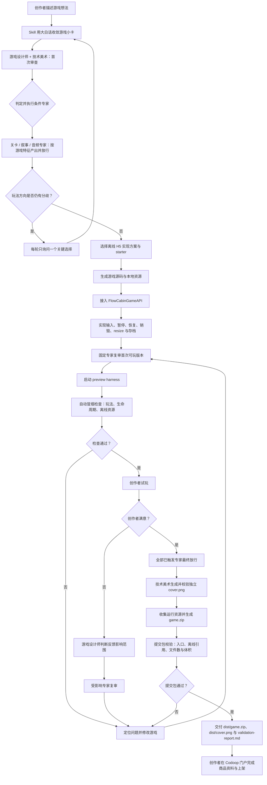

# 计划：Codoop Game（独立开源 Skill）

> **状态**：设计中，未开始实现  
> **目标仓库**：`Codoop/codoop-game`  
> **核心 Skill**：`codoop-game`  
> **首版定位**：`codoop-game` 让 coding agent 从一句游戏想法开始，反复生成、试玩和改进离线 H5 游戏，最后交付可提交到 Codoop 的 `game.zip` 与 `cover.png`。创作者在 Codoop 门户中掌控发布，游戏可自由选择类型、策略和游玩节奏。

---

## 1. 已锁定的产品决策

| 决策 | 首版选择 |
|---|---|
| 分发方式 | 独立开源仓库，可直接安装到创作者的工作环境 |
| Agent 支持 | 首版为 Codex 与 Claude 提供完整插件安装和验证体验 |
| 最终产物 | 校验通过的离线 H5 `game.zip` 与最终 `cover.png` |
| Skill 范围 | 首版只提供一个 `codoop-game` skill，负责游戏本体、封面、预览、兼容性与提交包 |
| 发布权限 | 创作者携带游戏包和封面进入 Codoop 门户，在那里确认最终上架设置与发布 |
| 玩法范围 | 支持街机、益智、策略、模拟等多种类型，玩家自由决定单局时长与游戏节奏 |
| 体验底线 | 游戏由玩家决定策略与节奏，但必须可暂停、恢复、销毁和续玩 |
| 创作者门槛 | 面向不懂开发的创作者；agent 用大白话共同设计和交付游戏，自动承担技术选择与工程工作 |

首版以“随时停下，回来继续”为质量体验。Flow Cabin 面对的是不确定时长的 AI 任务，skill 会让游戏安全中断与恢复，并把策略和结束时机交给玩家。

## 2. 用户与使用场景

**主要创作者**：有游戏想法、没有编程经验的用户。他们可以从“我想做一个种田小游戏”直接开始创作。

### 2.1 面向小白的对话原则

- 从游戏体验开始：问“玩家在做什么、怎么赢、画面什么感觉”，由 agent 负责框架、事件模型和构建工具。
- 每轮最多询问一个会实质改变游戏的选择；有合理默认值时直接说明采用的默认值并继续。
- 用玩家能理解的话解释进度，例如“我正在让游戏记住你的进度”。
- 报错先说影响和下一步，例如“这个图片来自外网，离线发布后会看不到；我会换成本地文件”，技术细节放在可展开的诊断报告。
- 交付时给可点击的预览和一句话操作说明，用户可以直接试玩和提交。
- agent 在后台完成工程决策、测试与打包，并主动说明已经完成和验证的内容。

**触发示例**：

- “做一款可在 Flow Cabin 里玩的回合制地牢策略游戏。”
- “我想做一个玩家可以随时停下、回来继续玩的种田小游戏。”
- “帮我做一款像素风的太空贸易策略游戏，最后给我可以提交的游戏包和封面。”

## 3. Codoop Desktop 游戏兼容性契约（独立开发基线）

本节是新建 `codoop-game` 工程时必须随仓库携带的**冻结开发与发布契约**。Skill、starter、preview harness、静态校验和端到端测试都必须以此为准；开发者不需要再阅读 Codoop PC 端源码才能生成兼容游戏。Codoop Desktop 的集成实现与测试以本节作为完成目标；若将来改变任一契约，应升级本节和 `docs/compatibility.md` 的版本后再修改 skill。

本节只描述游戏在 Codoop Desktop 内**可观察、必须遵守**的行为；不包含门户、服务端签名、下载或安装的内部实现。

### 3.1 宿主与沙箱

- 游戏在 Electron `<webview>` 中加载 ZIP 解压后的根目录 `index.html`；不是浏览器标签页，也不能假设有 Node、Electron、文件系统或宿主 DOM 权限。
- 宿主固定使用 `nodeIntegration=false`、`contextIsolation=yes`、`sandbox=yes`；游戏唯一允许的宿主能力是 `window.FlowCabinGameAPI`。禁止引用 `require`、`process`、`ipcRenderer`、Node 内建模块或任意 Electron API。
- 每个游戏使用独立持久化分区 `persist:game-<gameId>`。可将 `localStorage` 用于游戏自身的轻量进度，但不得依赖其他游戏、宿主窗口或网络状态；首次运行、清理数据和 webview 重建都必须可安全处理。
- webview 充满 Flow Cabin 游戏区域。没有全屏、窗口控制、任意 IPC、文件选择或跨窗口通信 API。
- 游戏应在加载完成、事件监听和首帧准备好后调用一次 `FlowCabinGameAPI.ready()`；可调用 `reportScore(number)` 与 `reportProgress(unknown)` 上报展示/遥测信号，但它们不能是游戏保存或业务逻辑的前提。

### 3.2 尺寸、输入与焦点

- 通过 `getCanvasSize()` 读取当前可绘制区域；返回值等于当前 webview 的 `window.innerWidth` / `window.innerHeight`，单位为 CSS 像素。
- 初始布局和每次原生 `window.resize` 后都必须重新读取尺寸并重排 Canvas/DOM。不得假定固定宽高，不得以浏览器全屏尺寸设计 UI。
- 键盘核心白名单为 A–Z、主键盘与数字小键盘 0–9、四个方向键和空格。`Tab`、`Enter`、F1–F12 及 Ctrl/Cmd/Alt 组合键不是游戏输入；`Escape` 由宿主保留，不得作为游戏控制。
- webview 获得焦点时，宿主直接规范化本地 `keydown`/`keyup`；终端获得焦点时，Codoop 可把白名单键转发到游戏。游戏必须只订阅 API，而不能依赖原生事件一定到达或自行 `preventDefault()`。
- 鼠标监听发生在 webview 内；坐标相对游戏区域左上角，`x` 向右、`y` 向下，单位为 CSS 像素。`onMouseClick` 对应按下事件，不等同于浏览器的完整 click 语义。

### 3.3 提交包

- 提交的是纯静态 H5 zip，必须含 `index.html`。
- 上传限制：zip ≤20MB、最多 500 文件、解压后 ≤40MB。
- 提交包使用 `.html`、`.css`、`.js`、`.wasm`、图片、`.json`、`.mp3`、`.ogg` 等离线静态资源。
- 所有资源随包提供，确保游戏在没有网络连接时也能完整运行。

本 skill 的责任止于产出可上传的静态游戏包；上传后的安全校验、签名、发布和安装均属于 Codoop 平台，不写入此 skill 的实现设计。

#### 完整游戏交付物

一个可提交的 Codoop 游戏由“运行包”“封面资源”和“平台完整性资料”三层组成：

| 层 | 文件 | 当前要求 | 说明 |
|---|---|---|---|
| 运行包 | `game.zip` | 必需 | 创作者上传到开发者门户的离线 H5 压缩包 |
| 运行包 | `index.html` | 必需 | 游戏入口；`codoop-game` 统一在 zip 根目录生成它，便于桌面端直接加载 |
| 运行包 | `app.js` 或其他 `.js` | 按实现需要 | 游戏逻辑；所有引用的脚本都随包提供 |
| 运行包 | `styles.css` | 按实现需要 | 游戏界面样式；也可使用其他本地 CSS 文件 |
| 运行包 | `assets/` | 按实现需要 | 本地图片、SVG、WebP、JSON、WASM、MP3、OGG 等游戏资源 |
| 封面资源 | `cover.png` | 必备交付物，但不放入市场 `game.zip` | 商品封面；可由用户提供，也可由 coding agent 创作；skill 统一校验并整理为推荐的 PNG、16:9、至少 640×360 |

`codoop-game` 的推荐输出形态：

```text
dist/
├── game.zip                 # 上传到 Codoop 的文件
├── cover.png                # 用户提供或 coding agent 创作的商品封面
└── validation-report.md     # 本地验证结果，供 agent 自检
```

其中 `game.zip` 的内容保持简单：

```text
game.zip
├── index.html               # 必需
├── app.js                   # 推荐：游戏主逻辑
├── styles.css               # 推荐：界面样式
└── assets/                  # 可选：游戏图片、音效、数据和 WASM
    ├── sprites.png
    ├── click.ogg
    └── data.json
```

`cover.png` 是和 `game.zip` 并列交付的商品素材，**不放入市场提交 ZIP**，也不应被游戏运行时引用。创作者在门户的上架步骤中上传或关联它。仅当游戏本身确实需要使用该图片时，才将一份运行时资源放进 `assets/`；它与商品封面是两个不同用途的文件。官方内置游戏的封面打包约定属于 Codoop 应用内部实现，不属于本独立 skill 的提交格式。

### 3.4 生命周期与 Flow Cabin 状态

Flow Cabin 是 Codoop 在 AI CLI 任务运行期间提供的互动区域。游戏不能控制状态，只能响应宿主可用的生命周期和页面事件：

| Codoop 聚合状态 | Flow Cabin 表现 | 游戏预期 |
|---|---|---|
| `UNLOCKED` | 面板打开、键盘可用、游戏运行 | 接收输入并正常运行 |
| `FROZEN` | 面板保持可见、画面去饱和、键盘暂停 | 保持一致状态，安静等待恢复后的下一次用户输入 |
| `PAUSED` | 面板收起、游戏暂停 | 停止活动循环，并通过生命周期与页面事件保存和清理 |
| `LOCKED` | 面板收起 | 继续保持可恢复状态，等待新的 AI 会话 |

状态只由 AI Watcher 的**聚合状态**驱动；多会话场景中，只要任一会话仍在运行，Flow Cabin 保持 `UNLOCKED`。这一规则确保游戏不会因另一会话完成而提前暂停。

**Desktop 生命周期契约：** Codoop Desktop 通过 `game:pause`、`game:resume` 与 `game:destroy` 驱动对应的 `FlowCabinGameAPI` 回调；Skill 的真实 Desktop 集成测试验证这条链路。游戏同时处理 `visibilitychange` 和 `pagehide`，使暂停、面板切换、webview 重建等场景都能保留可恢复状态。

生命周期回调的实施要求如下：

1. `onPause`：保存最小一致快照，取消 `requestAnimationFrame`、interval/timeout、音频和临时交互；回调可重复，必须幂等。
2. `onResume`：从内存或本地持久化状态恢复，只启动一个游戏循环；不得重复注册监听器或叠加 timer。
3. `onDestroy`：执行 `onPause` 等价清理，再解绑所有监听器、释放 AudioContext/图像资源和引用；回调后不再更新 DOM 或上报状态。
4. 游戏还应在 `visibilitychange` / `pagehide` 中做保守保存，使 webview 重建后仍能恢复进度。

### 3.5 FlowCabinGameAPI（冻结接口）

游戏在 webview 中可使用下面的全局对象。`codoop-game` 应把这份 API 作为源码模板、preview harness 和静态检查的共同依据。

```ts
type KeyboardEventPayload = {
  type: 'keydown' | 'keyup';
  key: string;
  code: string;
  timestamp: number;
  repeat: boolean;
};

type MouseEventPayload = {
  type: 'click' | 'move' | 'wheel';
  button?: 'left' | 'right' | 'middle';
  x: number;
  y: number;
  deltaX?: number;
  deltaY?: number;
  timestamp: number;
};

interface FlowCabinGameAPI {
  onKeyDown(cb: (event: KeyboardEventPayload) => void): void;
  onKeyUp(cb: (event: KeyboardEventPayload) => void): void;
  onMouseClick(cb: (event: MouseEventPayload) => void): void;
  onMouseMove(cb: (event: MouseEventPayload) => void): void;
  onMouseWheel(cb: (event: MouseEventPayload) => void): void;
  onPause(cb: () => void): void;
  onResume(cb: () => void): void;
  onDestroy(cb: () => void): void;
  ready(): void;
  reportScore(score: number): void;
  reportProgress(data: unknown): void;
  getCanvasSize(): { width: number; height: number };
}
```

接口使用约束：

- 所有 `on*` 仅注册回调，当前 v1 **没有 unsubscribe 返回值**。游戏必须把注册集中在一次初始化中，避免 resume/restart 时重复注册；销毁时以内部 `destroyed` 标志阻止回调继续改变状态。
- `KeyboardEventPayload.code` 用于区分 `Digit1` 与 `Numpad1`；`repeat` 表示操作系统自动重复。游戏若需要“单次按下”逻辑，必须自行忽略 `repeat=true`。
- `MouseEventPayload.type` 固定为 `click`、`move` 或 `wheel`；滚轮事件提供 `deltaX` / `deltaY`，点击事件提供 `left`、`right` 或 `middle`。所有回调均在游戏页面上下文运行。
- `reportScore` 的参数必须是有限数字；`reportProgress` 仅传可序列化、非敏感的游戏摘要。两者均不保证持久化或回传结果。

### 3.6 离线资源与 CSP

- 游戏必须是纯静态、完全离线的 H5 包。HTML、CSS、JS、WASM、图片、字体、数据和音频都应使用 ZIP 内的相对路径；不得使用 `http:` / `https:`、CDN、远程字体、`fetch`、`XMLHttpRequest`、WebSocket 或 `importScripts` 拉取资源。
- 为兼容 Codoop CSP，使用外部本地 `styles.css` 和 `app.js`（或等价本地文件），不要依赖内联 `<script>`、内联 `<style>`、动态 `eval`、`new Function` 或远程动态 import。若使用 WASM，必须作为 ZIP 内静态文件，并在 preview harness 中单独验证。
- 支持本地 `file:` 图片、`data:` / `blob:` 的运行时图像；禁止 frame、object、form 提交和网络连接。游戏不得注册 service worker。
- `validate-game.mjs` 必须静态扫描外链和危险动态执行模式；preview harness 必须在无网络条件下加载页面，确保生产环境不依赖浏览器缓存或开发服务器。

**Desktop CSP 契约：** Codoop 为市场游戏提供允许本地外部脚本、样式、图片和字体加载的静态 CSP：`default-src 'none'; script-src 'self' file:; style-src 'self' file:; img-src file: data: blob:; font-src file:; connect-src 'none'; frame-src 'none'; object-src 'none'; base-uri 'none'; form-action 'none'`。Skill 将此策略写入 `docs/compatibility.md`，并通过真实 Desktop webview 验证 `app.js`、`styles.css` 和本地资源稳定加载。

### 3.7 本地 preview harness 的等价要求

`preview-harness.mjs` 不是普通浏览器预览。它必须在本地页面注入最小的 `window.FlowCabinGameAPI` mock，并提供以下可操作测试：

| 能力 | harness 必须模拟/检查 |
|---|---|
| 尺寸 | 初始小尺寸与至少一次 resize；验证游戏重新布局且核心操作可见 |
| 键鼠 | 结构化白名单键的 keydown/keyup、鼠标按下/移动/滚轮及相对坐标 |
| 生命周期 | pause → resume → destroy 的顺序与重复 pause/resume；验证循环、timer 和监听器不泄漏 |
| 离线 | 断网加载、本地资源缺失和外链扫描失败路径 |
| 状态 | 捕获 `ready`、score、progress 调用，但不伪造平台持久化成功 |

harness mock 的 API 名称、参数、事件 payload 和生命周期顺序必须与 §3.5 一致；它不得扩展生产环境不存在的宿主能力。

### 3.8 交付边界

`codoop-game` 只生成并本地校验以下文件：

```text
dist/game.zip    # 游戏运行包，上传到门户
dist/cover.png   # 商品封面，在门户的上架步骤中使用
```

门户中的标题、简介、定价、封面上传/关联和发布确认，以及服务端对上传包的后续处理，均不属于本 skill 的范围。本仓库只维护影响游戏可运行性和 ZIP 可提交性的公开兼容性契约。

### 3.9 新工程的 Desktop 集成清单

新建 `codoop-game` 仓库时，必须把以下规则原样落实到 `references/flow-cabin-api.md`、starter、preview harness 和集成测试。它们是与 Codoop PC 端强绑定、不能由普通网页游戏替代的部分。

| 主题 | Skill 必须实现 | Codoop Desktop 契约 / 集成验收 |
|---|---|---|
| 宿主桥 | 只使用 `window.FlowCabinGameAPI`，并在浏览器预览中提供同名 mock | 沙箱不暴露 Node/Electron/通用 IPC；任意额外宿主调用均视为不兼容 |
| 尺寸与布局 | starter 在初始化和 `resize` 后调用 `getCanvasSize()` | webview 尺寸可变、没有全屏 API；最小面板下必须可用 |
| 键盘 | 只把白名单键作为核心控制，支持 `keydown` / `keyup` 与 `repeat` | 终端焦点时仅白名单可能被转发；组合键、Tab、Enter、Escape 不可依赖 |
| 鼠标 | 使用 API 的相对坐标，不假设屏幕坐标 | 点击为 `mousedown` 规范化事件；移动/滚轮在 webview 内发生 |
| 生命周期 | 注册三个回调，并以 `visibilitychange` / `pagehide` 增强恢复能力 | pause/resume/destroy 通过 `FlowCabinGameAPI` 到达游戏，并由真实 webview E2E 验收 |
| 安全与资源 | 纯本地外部 CSS/JS/资源，零网络、零 eval、零 service worker | 静态 CSP 支持本地资源加载；以真实 Desktop 断网加载验证，不以开发服务器代替 |
| 产物 | ZIP 根目录 `index.html`，`cover.png` 独立 | `game.zip` 只含运行资源；商品封面不进入市场 ZIP |

`docs/compatibility.md` 必须以 `FlowCabinGameAPI v1` 为标题维护这张清单、Desktop 契约和变更记录。任何 API 字段、键盘白名单、CSP 规则、生命周期或 ZIP 限制的变化，均属于兼容性变更：先更新该文档与 preview harness，再更新 starter、校验脚本和集成测试。

## 4. 首版功能设计

### 4.1 单一创建循环

首版只支持从自然语言想法创建新游戏。`codoop-game` 在内部完成预览、校验和打包；创作者只需反复试玩并说明下一项想调整的体验。

```text
创作者描述想法
  → agent 生成可试玩版本
  → 创作者试玩并给出反馈
  → agent 修改游戏
  └──────────────────────→ 回到试玩

创作者确认满意
  → 自动完成完整校验与打包
  → 交付 game.zip 与 cover.png
```

每轮只处理一个玩家可感知的变化，例如移动手感、奖励反馈或难度节奏。agent 必须先给出可试玩版本，再进入下一轮；除非玩法方向存在真正分歧，否则不要求创作者作技术选择。

### 4.2 专家编排（必须实际执行）

用户始终只与一个友好的 `codoop-game` 助手对话；专家不是供用户选择的聊天角色，而是保存在 `skills/_shared/` 中、由 Skill 在规定节点按需加载的独立定义文件。每次执行必须把相应专家的结论写入本轮游戏工作目录的 `design-notes.md`，并在交付前汇总进 `validation-report.md`。没有完成必经专家的产出，不得进入下一质量门。

| 专家定义文件 | 触发节点 | 必须产出 | 放行条件 |
|---|---|---|---|
| `_shared/game-designer.md` | 每个游戏的游戏小卡；每次试玩反馈后 | 玩家目标、核心循环、操作、反馈、胜负/续玩和本轮改动假设 | 可用一句话说明“玩家做什么、为什么想继续、如何结束或重试” |
| `_shared/technical-artist.md` | 每个游戏首次可试玩版本前；生成封面前 | 面板布局、可读性、视觉层级、资源预算；封面 art direction | 在最小 Flow Cabin 尺寸下 HUD、主操作和反馈可辨；封面与游戏主题一致 |
| `_shared/level-designer.md` | 存在地图、房间、路线、敌人波次、经营周期或难度推进时 | 关卡/回合节奏表、难度曲线、首局引导和失败后的恢复策略 | 首局能在合理时间内理解目标；难度变化有明确原因而非随机堆叠 |
| `_shared/narrative-designer.md` | 有角色、剧情、对话、任务文本或选择后果时 | 世界观一句话、角色语气、文本清单和分支后果 | 每段文本服务于目标、反馈或选择，不阻塞核心操作 |
| `_shared/audio-designer.md` | 使用任何音效或创作者明确希望有声音时 | 事件→音效映射、音量/静音策略、离线资源清单 | 关键操作、奖励和失败有可区分反馈；无外链音频且静音不影响游玩 |

**执行规则：**

1. `SKILL.md` 先读取本 Skill 的 `references/expert-orchestration.md`，根据游戏小卡创建本轮专家任务清单；然后固定读取 `_shared/game-designer.md` 与 `_shared/technical-artist.md`，并按触发条件读取其余共享专家定义文件。
2. 条件专家一旦命中，必须在首次实现前介入；后续修改触及其负责领域时必须重新读取并执行对应定义。例如改难度时读取 `level-designer.md`，改文本时读取 `narrative-designer.md`。
3. 创作者只看由主助手整合后的自然语言结论和可试玩版本；专家原始清单进入 `design-notes.md`，不要求创作者阅读或做技术决策。
4. 每次试玩反馈先由游戏设计师判断影响范围，再只调用受影响的专家；随后才修改代码、启动预览和运行质量检查。
5. 打包前重新读取已触发专家的定义文件并完成最终体验复审；技术脚本只在全部专家放行后执行兼容性与产物校验。

这些视角借鉴 [agency-agents 的游戏开发角色](https://github.com/msitarzewski/agency-agents/tree/main/game-development) 的工作方法，并针对 Codoop 的离线 H5 与 Flow Cabin 面板环境整理为可执行检查清单。

### 4.3 创建工作流

1. 用大白话把想法收敛成一页“游戏小卡”；游戏设计师和技术美术完成首次审查，Skill 判定条件专家并写入 `design-notes.md`。用户只需确认整合后的游戏小卡。
2. 所有已触发专家完成首次放行后，agent 提出一个可玩的默认版本并直接开始实现；只有玩法方向存在真正分歧时才请求选择。
3. 生成可维护的本地静态游戏；默认使用零依赖 Canvas/DOM，也支持将其他技术栈构建为离线产物。
4. 接入 `FlowCabinGameAPI`；浏览器预览环境提供开发用 mock，发布包保留纯游戏资源。
5. 实现暂停、恢复、销毁、resize 与必要的本地存档；对用户表述为“随时停下，回来还能继续”。
6. agent 自行运行玩法冒烟测试、生命周期和离线资源检查；游戏设计师和技术美术复审可试玩版本，通过后交付预览。
7. 创作者每次只提出一项想改变的体验；游戏设计师先判断影响范围，再由相关专家复审，agent 修改后回到预览与检查，直到创作者确认满意。
8. 创作者确认交付后，所有已触发专家完成最终放行；agent 再完成静态校验、打包校验与封面校验，输出 `game.zip` 与 `cover.png`，提示用户“下一步带着这两个文件到门户上架”。

### 4.4 完整开发流程



图中 `game.zip` 只来自游戏运行资源；商品 `cover.png` 在最后独立生成、校验和交付，不回写进 ZIP。

### 4.5 质量门槛

- 有可理解的目标、反馈和重试或持续进度机制。
- 支持玩家自由选择策略深度、游戏类型和单局长度。
- 暂停时保存一致的游戏状态；恢复后自然继续；销毁时完整清理 listener 与 animation frame。
- 在狭窄 Flow Cabin 面板与 resize 后仍可看清并操作。
- 使用完整离线资源与精简构建产物，保障稳定加载。
- 生成文件、文件数和体积均在公开提交限制内。
- 小白用户通过自然语言即可得到可预览、可提交的产物。

## 5. 开源仓库结构

```text
codoop-game/
├── README.md                         # 安装、首个游戏、产物与贡献说明
├── LICENSE                           # MIT
├── package.json                      # 仅开发脚本、测试与格式化依赖
├── .gitignore                        # 忽略 preview 临时目录、dist/ 与测试产物
├── .agents/
│   └── plugins/
│       └── marketplace.json          # Agent marketplace 发现信息（如需要）
├── .codex-plugin/
│   └── plugin.json                   # Codex 插件入口；指向唯一 skill
├── .claude-plugin/
│   └── plugin.json                   # Claude 插件入口；指向同一份 skill
├── skills/
│   ├── _shared/
│   │   ├── game-designer.md          # 固定：游戏小卡、反馈诊断与体验放行
│   │   ├── technical-artist.md       # 固定：小面板可读性、资源预算与封面
│   │   ├── level-designer.md         # 条件：地图、关卡、难度和节奏
│   │   ├── narrative-designer.md     # 条件：角色、文本和选择后果
│   │   └── audio-designer.md         # 条件：音效事件、静音与离线音频
│   └── codoop-game/
│       ├── SKILL.md                  # 对话主流程、何时提问、何时预览/交付
│       ├── references/
│       │   ├── flow-cabin-api.md     # FlowCabinGameAPI、输入与生命周期契约
│       │   ├── game-quality.md       # 游戏小卡、可玩性与小面板 UX 检查表
│       │   ├── package-contract.md   # game.zip 结构、离线资源、公开限制
│       │   ├── cover-contract.md     # 独立 cover.png 的尺寸、比例与校验规则
│       │   └── expert-orchestration.md # 专家判定、加载顺序、记录与打包门禁
│       ├── assets/
│       │   ├── vanilla-canvas-starter/ # 零依赖 Canvas 起步模板
│       │   └── vanilla-dom-starter/    # 零依赖 DOM 起步模板
│       └── scripts/
│           ├── create-game.mjs       # 从 starter 创建隔离的游戏工作目录
│           ├── preview-harness.mjs   # 本地宿主 mock、输入和生命周期控制
│           ├── validate-game.mjs     # 静态资源、入口、外链、体积与文件数检查
│           ├── validate-cover.mjs    # cover.png 格式、尺寸与 16:9 比例检查
│           └── package-game.mjs      # 仅收集运行资源，生成 dist/game.zip
├── examples/
│   └── resumable-game/               # 完整示例：源码、资源、封面和预期产物
├── tests/
│   ├── fixtures/                     # 合法与非法 ZIP/资源/封面测试样本
│   ├── unit/                         # 校验、打包路径与 API mock 单测
│   └── integration/                  # 从创建到预览、校验和产物生成的流程测试
└── docs/
    └── compatibility.md              # FlowCabinGameAPI v1、Desktop 契约与迁移说明
```

- 插件入口只负责让 Codex 和 Claude 发现同一份 `skills/codoop-game/SKILL.md`，不得复制或分叉规则；所有行为、文案和参考资料都以该目录为唯一来源。
- 游戏源码不写入 skill 仓库。`create-game.mjs` 在创作者选定的工作目录创建独立游戏项目；每次预览、校验和打包都针对该项目运行。
- `SKILL.md` 保持简短，只规定创建循环、面向小白的对话方式、专家编排、必经质量门和参考文件的加载时机；稳定技术细节放在 `references/`。
- `skills/_shared/` 直接存放可跨 Skill 复用的专家定义文件，不额外嵌套 `experts/` 目录；每份文件包含角色边界、触发条件、输入、检查清单、必须产出和放行条件。`references/expert-orchestration.md` 仅定义 `codoop-game` 的加载顺序、复审规则与打包门禁。
- `SKILL.md` 只在命中时读取条件专家文件：首次游戏小卡固定读取游戏设计师和技术美术；地图/难度、剧情/选择、音效需求分别读取关卡、叙事、音频定义。每次受影响的改动和打包前复审都重新读取对应文件。
- Skill 把每次专家执行的结论写入游戏项目的 `design-notes.md`，并在 `validation-report.md` 记录每位已触发专家的最终放行结果。
- `package-game.mjs` 只读取经校验的运行产物，永不将 `cover.png` 打入 `game.zip`；`validate-cover.mjs` 单独校验并保留 `dist/cover.png`。
- `tests/integration/` 至少覆盖一次完整闭环：starter → preview harness → 生命周期检查 → `game.zip` + 独立 `cover.png`。

建议以 MIT 许可发布，脚本不引入运行时 npm 依赖；仓库的公开 README 负责安装和贡献说明，skill 本体不额外携带冗余说明文档。

## 6. 首版交付路径

### 核心 Skill

1. 初始化 `codoop-game` skill、Codex 插件清单与 Claude 插件清单；两个入口共享同一份 skill 内容和确定性脚本。
2. 编写“游戏小卡”对话流程与小白语言准则；用从一句自然语言想法开始的真实 prompt 前测。
3. 提供 Canvas/DOM starter 和一个可暂停、可恢复、可 resize 的示例游戏。
4. 在 `codoop-game` 内实现预览、校验与打包的内部流程；它们不是首版面向用户的独立模式。
5. 实现专家任务清单、`design-notes.md` 与最终放行汇总；未完成的专家放行必须阻止打包。
6. 对专家触发、zip 规则、外链、尺寸、生命周期和 API 使用编写自动测试；以真实 Codoop Desktop webview 完成键鼠、resize、CSP 和离线加载验证。
7. 完成 `game:pause` / `game:resume` / `game:destroy` 的真实 Codoop Desktop 端到端测试，并将通过结果写入兼容性报告。

## 7. 验收标准

首版发布前，以下必须全部满足：

- 一个从自然语言创建的游戏能在 preview harness 中接收键鼠、暂停、恢复、resize。
- skill 在交付前自动检查资源、体积、入口文件和生命周期；失败时以大白话说明影响和修复方向。
- skill 自动输出通过本地检查的精简 zip，包含发布所需的最终静态资源。
- 每个 starter 在真实 Codoop Desktop sandbox 中只看到 `window.FlowCabinGameAPI`，并通过键鼠、resize、CSP 与断网加载验证；不得仅以普通浏览器预览作为兼容性结论。
- `docs/compatibility.md` 明确记录 `FlowCabinGameAPI v1`、键盘白名单、CSP/离线约束和 lifecycle 集成测试结果。
- lifecycle callback 与 `visibilitychange` / `pagehide` 共同保障暂停、恢复、销毁和 webview 重建时的进度安全。
- 每个游戏都有游戏设计师与技术美术的审查记录；所有条件命中的专家都在 `validation-report.md` 留下明确的放行结果，缺失任何必经结果时不得打包。
- 零编程经验用户仅以自然语言描述游戏想法，即可获得游戏小卡、可运行预览和提交 zip。
- 所有面向用户的提示都说明“发生了什么、会有什么影响、接下来怎么做”；诊断文件提供完整技术依据。
- 同一条创建游戏 prompt 在 Codex 与 Claude 的插件安装路径中都能触发 `codoop-game`，并生成通过相同校验的提交包。
- 至少一个端到端示例完成从创建、预览到生成 `game.zip` 与独立 `cover.png` 的验证。

## 8. 首版聚焦

- `codoop-game` 提供从自然语言想法到可试玩、可提交游戏包的单一创建循环；预览、验证、打包与 Codoop 兼容性均在内部完成。
- 离线、稳定、可中断恢复的单人游戏体验。
- 创作者自主定义题材、策略深度、单局时间与盈利模式。
- 基于稳定 `FlowCabinGameAPI` 的可靠游戏兼容性。
